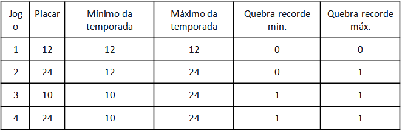
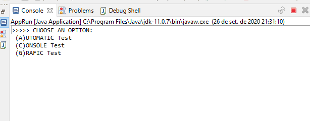
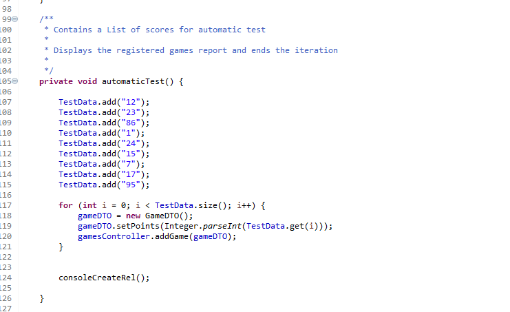
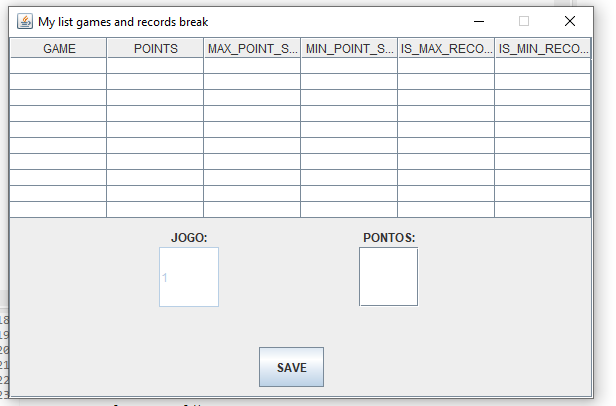

# Problema

Maria é jogadora de basquete e criou uma tabela para registrar suas pontuações. A cada jogo ela anota quantos pontos conseguiu marcar e atualiza o mínimo e o máximo da temporada. Ela anota também nesta tabela quantas vezes quebrou o recorde mínimo e quantas vezes quebrou o recorde máximo. Os placares são sempre números inteiros e positivos menores que 1000 Depois de 4 jogos a tabela está assim:

Crie um programa na sua linguagem de programação preferida para facilitar o acompanhamento de resultados da Maria. 

# Requisitos mínimos:
    • Possibilidade de inserção de novos jogos;
    • Cálculo do mínimo e máximo da temporada;
    • Cálculo da quantidade de vezes que o recorde foi quebrado;
    • Interface para inserção dos dados;
    • Interface para consulta dos dados;
    • Testes unitários;
    • Controle de versão Git;
    • Documentação do código;

# Apresentação da Solução
Para executar o programa desenvolvido para o problema proposta, após fazer a compilação deverá escolher entre uma das opções do menu, conforme a imagem a seguir:
 

O teste automatizado pode ter seus dados alterados no seguinte método:

A opção por interface gráfica da biblioteca swing possibilita a inserção de até 10 itens:

